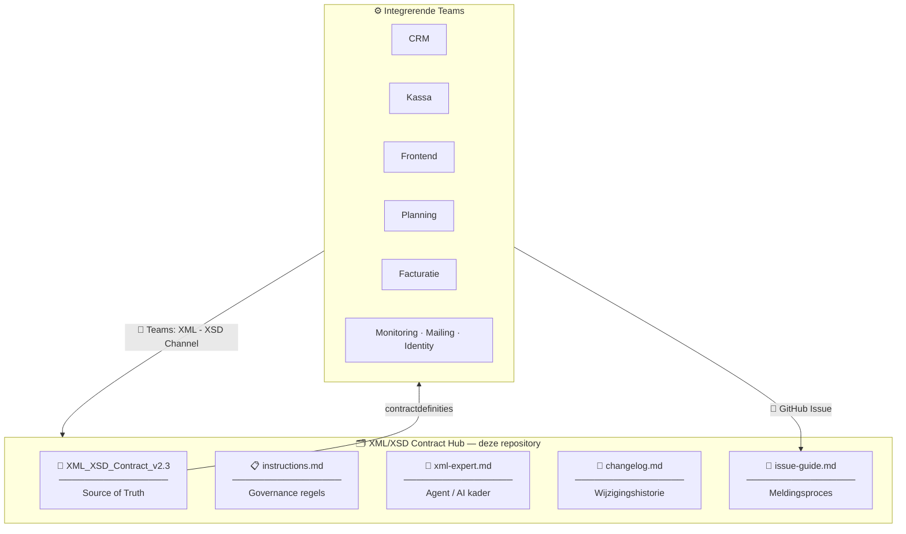
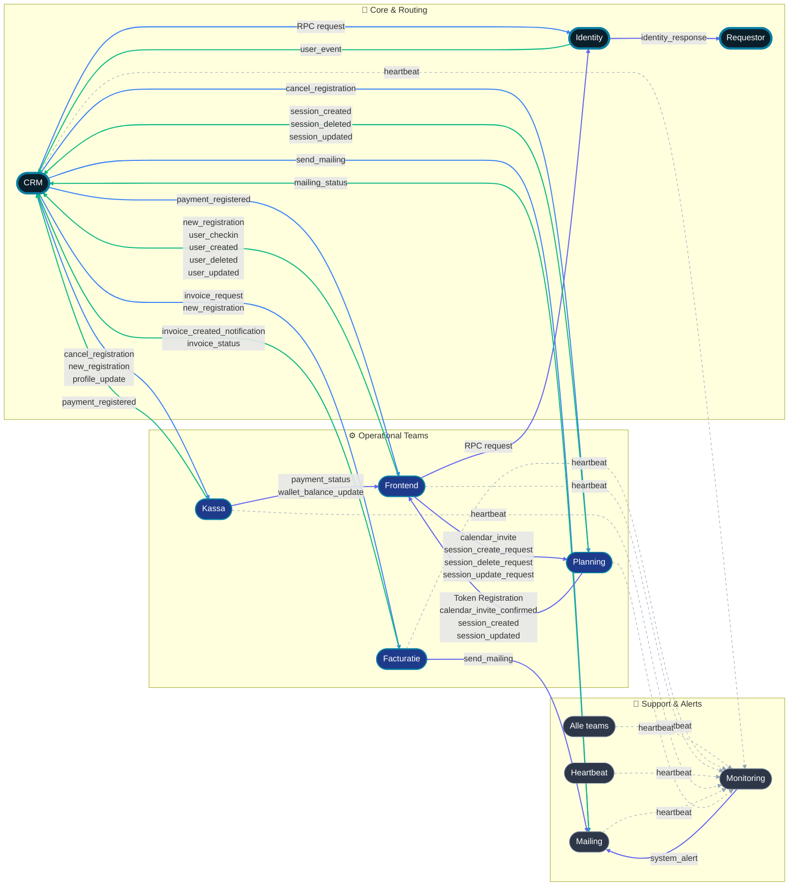
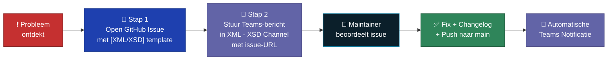
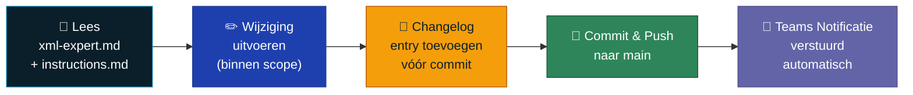
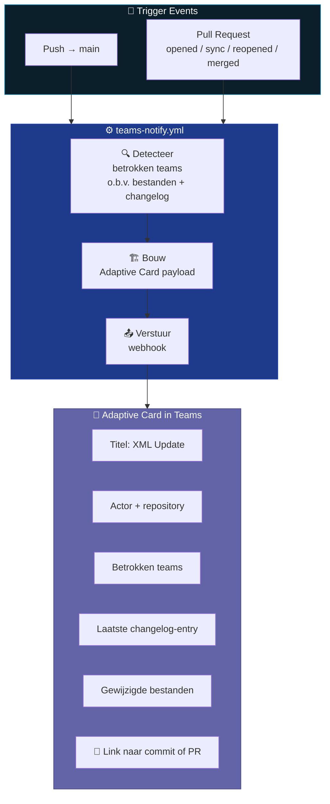

# XML/XSD Contract Hub

[](XML_XSD_Contract_v2.3_Centralized%201.md)
[](XML_XSD_Contract_v2.3_Centralized%201.md)
[](instructions.md)
[](#kernbestanden)

---

## Status & Metrics

[](../../actions)
[](changelog.md)
[](../../actions/workflows/teams-notify.yml)
[](#maintainers)
[](changelog.md)
[](../../actions/workflows/enforce-maintainers.yml)

> **Wat is dit?**  
> Deze repository is de **centrale Source of Truth** voor alle XML/XSD berichtafspraken binnen het Integration Project. Elke koppeling — CRM, Kassa, Frontend, Planning, Facturatie en meer — is gebonden aan de contractdefinities die hier beheerd worden. Afwijkingen worden hier gemeld, besproken en vastgelegd.

---

## Inhoudsopgave

1. [Doelgroep: wie ben jij?](#doelgroep-wie-ben-jij)
2. [Getting Started](#getting-started)
3. [Source of Truth Architectuur](#source-of-truth-architectuur)
4. [Kernbestanden](#kernbestanden)
5. [Governance & Regels](#governance--regels)
6. [Voor Niet-Admin Users: Problemen Melden](#voor-niet-admin-users-problemen-melden)
7. [Voor Maintainers: Wijzigingen Doorvoeren](#voor-maintainers-wijzigingen-doorvoeren)
8. [Teams Notificaties](#teams-notificaties-automatisch)
9. [Secrets Configuratie](#secrets-configuratie)
10. [Samenwerkingsafspraken](#samenwerkingsafspraken)

---

## Doelgroep: wie ben jij?

| Rol | Teams | Rechten |
|---|---|---|
| **Maintainer** | @tombomeke-ehb + aangewezen developer | Lezen · Wijzigen · Pushen naar `main` · PR mergen |
| **Niet-Admin User** | CRM · Kassa · Frontend · Planning · Facturatie · Monitoring · Mailing · Identity | Lezen · Issues openen · Teams-bericht sturen |

> ⚠️ **Niet-Admin Users mogen GEEN directe wijzigingen of Pull Requests doen aan de contractbestanden.**  
> Dit is technisch afgedwongen via `.github/workflows/enforce-maintainers.yml`.  
> Bij problemen of vragen volg je het proces onder [Voor Niet-Admin Users](#voor-niet-admin-users-problemen-melden).

---

## Getting Started

### Ben je een Niet-Admin User (CRM, Kassa, Frontend, …)?

1. Lees het officiële contract: [`XML_XSD_Contract_v2.3_Centralized 1.md`](XML_XSD_Contract_v2.3_Centralized%201.md).
2. Lees [`issue-guide.md`](issue-guide.md) zodat je weet hoe je fouten correct meldt.
3. Sluit je aan bij het Teams-kanaal **XML - XSD Channel** voor directe communicatie.
4. Wijzig **nooit** contractbestanden rechtstreeks — open altijd een issue.

### Ben je een Maintainer?

1. Lees [`xml-expert.md`](xml-expert.md) — verplicht voor elke sessie.
2. Lees [`instructions.md`](instructions.md) — bindende werkinstructies.
3. Werk in kleine, traceerbare stappen.
4. Registreer **elke** wijziging in [`changelog.md`](changelog.md) vóór je commit.
5. Configureer de vereiste secrets (zie [Secrets Configuratie](#secrets-configuratie)).

---

## Source of Truth Architectuur

De contractdefinities in deze repository bepalen de structuur voor alle integrerende systemen:



### Interactieve Netwerk-Map
Deze kaart wordt automatisch gegenereerd op basis van de contractdefinities en toont alle live berichtstromen tussen teams.

<!-- NETWORK_MAP_START -->



<!-- NETWORK_MAP_END -->

#### 💡 Legende
| Stijl | Betekenis |
| :--- | :--- |
| <span style="color:#10b981">**Groene pijl**</span> | Functioneel bericht **NAAR** de CRM (Inbound) |
| <span style="color:#3b82f6">**Blauwe pijl**</span> | Functioneel bericht **VANAF** de CRM (Outbound) |
| <span style="color:#6366f1">**Indigo pijl**</span> | Direct bericht tussen teams (Peer-to-peer) |
| <span style="color:#94a3b8">**Grijze stippellijn**</span> | Heartbeat / Status bericht naar Monitoring |

Elke koppeling **implementeert** de XML/XSD structuur zoals gedefinieerd in het centrale MD-bestand. Wijzigingen gaan altijd via de maintainers en worden bijgehouden in `changelog.md`. Teams ontvangen automatisch een melding via Microsoft Teams bij elke update.

---

## Kernbestanden

| Bestand | Doel |
|---|---|
| [`XML_XSD_Contract_v2.3_Centralized 1.md`](XML_XSD_Contract_v2.3_Centralized%201.md) | Officieel, gecentraliseerd XML/XSD contract — de functionele waarheid |
| [`xml-expert.md`](xml-expert.md) | Agent-definitie en strikte werkmodus voor contractwijzigingen |
| [`instructions.md`](instructions.md) | Bindende werkinstructies voor alle bijdragers (mens en AI) |
| [`issue-guide.md`](issue-guide.md) | Stap-voor-stap handleiding voor het openen van XML/XSD issues |
| [`changelog.md`](changelog.md) | Volledige historiek van wijzigingen met datum, tijd en auteur |

---

## Governance & Regels

> De volgende regels zijn bindend voor iedereen die in of met deze repository werkt.  
> Volledig kader: [`instructions.md`](instructions.md).

### Scope & Autoriteit
- Deze repository beheert de contract-documentatie en afspraken rond XML/XSD berichten.
- Het centrale contractbestand is de **functionele waarheid** voor structuur en validatieregels.
- Wijzigingen gebeuren bewust en gecontroleerd — nooit impulsief.
- **Alleen aangewezen maintainers** mogen wijzigingen uitvoeren.

### Kwaliteitsregels
- Consistentie gaat voor snelheid.
- Elke wijziging heeft een expliciete, gedocumenteerde reden.
- Berichtstructuren, naming en versies blijven uniform.
- Vermijd regressies door wijzigingen te toetsen aan bestaande afspraken.
- Twijfelgevallen worden eerst als issue gedocumenteerd.

### Verplichte Changelog-Entry
Na elke wijziging volgt **direct** een entry in `changelog.md` met dit formaat:

```md
## YYYY-MM-DD HH:MM (tijdzone)
- Auteur: ...
- Betrokken teams: ...
- Bestanden: ...
- Wijziging: ...
- Reden: ...
```

> Geen changelog-entry = geen complete wijziging.

### Definitie van Klaar
Een wijziging is pas klaar als:
1. De wijziging binnen scope is uitgevoerd.
2. De aanpassing duidelijk is beschreven.
3. `changelog.md` is bijgewerkt met datum en tijd.
4. Eventuele issue/PR context volledig is ingevuld.

---

## Voor Niet-Admin Users: Problemen Melden

> Je mag het contract **niet** zelf wijzigen of een Pull Request openen. Dit wordt technisch geblokkeerd.  
> Volg onderstaand twee-stappen-proces wanneer je een fout, onduidelijkheid of gewenste wijziging tegenkomt.



### Stap 1 — Open een formeel GitHub Issue

1. Ga naar **[Issues → New Issue](https://github.com/IntegrationProject-Groep1/xml-xsd-contract/issues/new/choose)**.
2. Kies het `[XML/XSD]` template.
3. Vul het template volledig in (zie [`issue-guide.md`](issue-guide.md) voor details):
   - Samenvatting van het probleem
   - Verwacht vs. huidig gedrag
   - Betrokken contractsectie
   - Reproductiestappen
   - Voorbeeld XML/XSD of foutmelding
   - Impact op teams/flows
4. Label het issue correct: `xml`, `xsd`, `bug`, `contract`.
5. Submit het issue en **kopieer de issue-URL**.

### Stap 2 — Stuur direct daarna een bericht in Teams

Ga naar het Microsoft Teams kanaal: **XML - XSD Channel**

Stuur een bericht met:
- De issue-URL uit stap 1
- Een korte omschrijving van het probleem
- Welke flow/team er impact van ondervindt

> Dit zorgt ervoor dat maintainers **direct** op de hoogte zijn en de urgentie kunnen inschatten. Enkel een issue zonder Teams-bericht kan over het hoofd worden gezien.

---

## Voor Maintainers: Wijzigingen Doorvoeren

<a name="maintainers"></a>

**Actieve Maintainers:** @tombomeke-ehb · aangewezen developer

### Workflow bij elke wijziging



1. Lees `xml-expert.md` en `instructions.md` — verplicht bij elke sessie.
2. Werk in kleine, begrijpelijke stappen; pas alleen aan wat binnen scope valt.
3. Vermijd brede bulk-wijzigingen zonder duidelijke motivatie.
4. Noteer impact op teams, flows en message types.
5. Schrijf duidelijke commit- en PR-beschrijvingen.
6. Update `changelog.md` **vóór** de commit.

### Enforcement

Toegang wordt gecontroleerd via:
- **`.github/workflows/enforce-maintainers.yml`** — blokkeert contractwijzigingen van niet-maintainers.
- **Secret `ALLOWED_CONTRACT_EDITORS`** — komma-gescheiden lijst van toegestane GitHub usernames.

> Zonder deze secret faalt de enforcement workflow bewust.

---

## Teams Notificaties (Automatisch)

Bij elke push naar `main` of PR-event stuurt `.github/workflows/teams-notify.yml` automatisch een Adaptive Card naar het **XML - XSD Teams channel**.



**Getriggerde events:**
- `push` naar `main`
- `pull_request` → opened, synchronize, reopened, merged

---

## Secrets Configuratie

Beide secrets zijn vereist voor volledige werking van de workflows.

### `TEAMS_WEBHOOK_URL`

Benodigd door: `teams-notify.yml`

1. Open GitHub repo **Settings**.
2. Ga naar **Secrets and variables → Actions**.
3. Klik **New repository secret**.
4. Naam: `TEAMS_WEBHOOK_URL`
5. Waarde: jouw Power Automate webhook URL.
6. Opslaan.

> Zonder deze secret draait de workflow wel, maar verstuurt ze **geen** webhook.

### `ALLOWED_CONTRACT_EDITORS`

Benodigd door: `enforce-maintainers.yml`

1. Open GitHub repo **Settings**.
2. Ga naar **Secrets and variables → Actions**.
3. Klik **New repository secret**.
4. Naam: `ALLOWED_CONTRACT_EDITORS`
5. Waarde: GitHub usernames, komma-gescheiden. Voorbeeld: `tombomeke-ehb,andereusername`
6. Opslaan.

> Zonder deze secret faalt de enforcement workflow bewust om ongeautoriseerde wijzigingen te blokkeren.

---

## Samenwerkingsafspraken

- Kleine, duidelijke wijzigingen werken beter dan grote bulk-edits.
- Elke wijziging is verklaarbaar: wat, waarom, impact.
- Geen wijziging zonder changelog-entry.
- Bij twijfel: issue openen en afstemmen vóór implementatie.
- PR's van niet-maintainers voor contractwijzigingen worden niet geaccepteerd.

---

> *XML/XSD Contract Hub — Integration Project Groep 1*  
> Centraal beheer van XML/XSD berichtafspraken voor alle integrerende teams.
