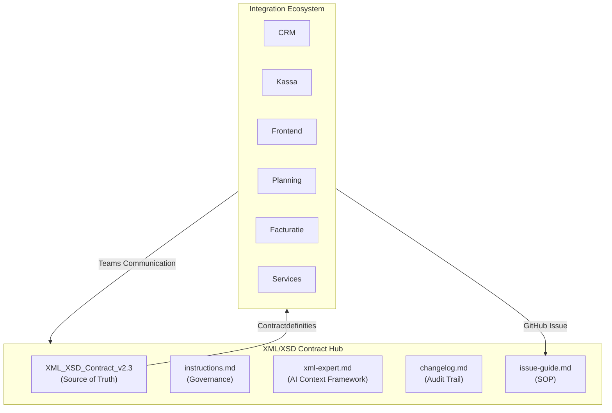
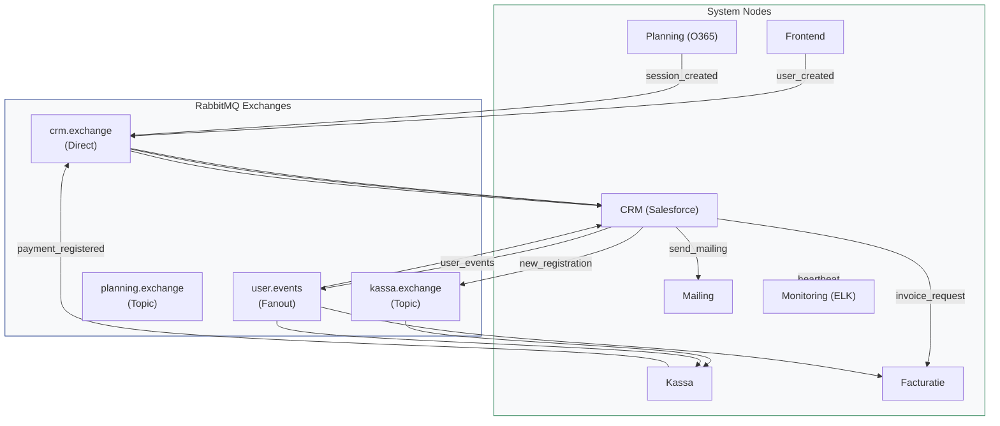
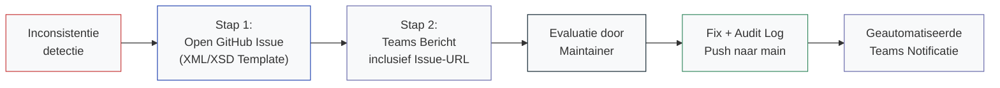

# XML/XSD Contract Hub

[](XML_XSD_Contract_v2.3_Centralized%201.md)
[](XML_XSD_Contract_v2.3_Centralized%201.md)
[](instructions.md)
[](#kernbestanden)

---

## Status & Operational Metrics

De onderstaande metrics bieden realtime inzicht in de integriteit en operationele status van de contractdefinities binnen het ecosysteem.

[](../../actions)
[](../../actions/workflows/teams-notify.yml)
[](../../actions/workflows/enforce-maintainers.yml)
[](changelog.md)
[](changelog.md)

> **Architecturaal Kader**  
> Deze repository fungeert als de **Gecentraliseerde Source of Truth** voor alle XML/XSD berichtafspraken binnen het Integration Project. Elke systeemkoppeling — waaronder CRM, Kassa, Frontend, Planning, Facturatie, Monitoring, Mailing en Identity — is strikt gebonden aan de contractdefinities die in dit platform worden beheerd.

---

## Inhoudsopgave

1. [Doelgroep & Rechtenbeheer](#doelgroep--rechtenbeheer)
2. [Operationele Startgids](#operationele-startgids)
3. [Systeemarchitectuur](#systeemarchitectuur)
4. [Interactieve Netwerk-Map (Message Flow)](#interactieve-netwerk-map-message-flow)
5. [Technische Berichtenstroom (Topologie)](#technische-berichtenstroom-topologie)
6. [Kernbestanden & Documentatie](#kernbestanden)
7. [Governance & Kwaliteitsstandaarden](#governance--kwaliteitsstandaarden)
8. [Incident & Change Reporting](#incident--change-reporting)
9. [Maintainer Operations](#maintainer-operations)
10. [Automatisering & Notificaties](#automatisering--notificaties)
11. [Systeemconfiguratie (Secrets)](#systeemconfiguratie-secrets)
12. [Samenwerkingsprotocollen](#samenwerkingsprotocollen)

---

## Doelgroep & Rechtenbeheer

Toegang tot de contractdefinities is gebaseerd op een strikt rollenmodel om de integriteit van de Source of Truth te waarborgen.

| Classificatie | Geassocieerde Teams | Autorisatieniveau |
|:---|:---|:---|
| **Maintainer** | Architectuurbeheer & Kern-ontwikkelaars | Read/Write · Push naar `main` · PR Approval |
| **Developer** | CRM · Kassa · Frontend · Planning · Facturatie · e.a. | Read-only · Issue Management |

> **Handhaving:** Gebruikers zonder beheerrechten kunnen geen directe modificaties of Pull Requests doorvoeren. Dit beleid wordt technisch afgedwongen via de `enforce-maintainers.yml` workflow.

---

## Operationele Startgids

### Voor Developers (Integratie-teams)

1. **Specificatie-analyse:** Bestudeer het officiële contract: [`XML_XSD_Contract_v2.3_Centralized 1.md`](XML_XSD_Contract_v2.3_Centralized%201.md).
2. **Procesbeheer:** Raadpleeg de [`issue-guide.md`](issue-guide.md) voor de correcte afhandeling van inconsistenties.
3. **Communicatie:** Participeer in het Microsoft Teams kanaal **XML - XSD Channel** voor directe afstemming.
4. **Beperking:** Voer onder geen beding directe wijzigingen door in de contractbestanden.

### Voor Maintainers (Beheerders)

1. **Context-validatie:** Lees voorafgaand aan elke sessie [`xml-expert.md`](xml-expert.md) en [`instructions.md`](instructions.md).
2. **Methodiek:** Werk uitsluitend in geisoleerde, traceerbare stappen.
3. **Auditering:** Elke modificatie vereist een onmiddellijke registratie in [`changelog.md`](changelog.md) voorafgaand aan de commit.
4. **Configuratie:** Verifieer de aanwezigheid van de vereiste repository secrets.

---

## Systeemarchitectuur

De onderstaande visualisatie beschrijft de hiërarchische structuur van de repository en de interactie met de externe integratie-ecosystemen:



---

## Interactieve Netwerk-Map (Message Flow)

Deze kaart wordt automatisch gegenereerd op basis van de contractdefinities en toont alle live berichtstromen tussen teams.

### 

#### Legende
| Kleur / Stijl | Richting & Betekenis |
| :--- | :--- |
|  **Groen** | Bericht **NAAR** de CRM (Inbound Hub) |
|  **Blauw** | Bericht **VANAF** de CRM (Outbound Hub) |
|  **Indigo** | Direct bericht tussen teams (Peer-to-peer) |
|  **Grijs** | Heartbeat / Status naar Monitoring (stippellijn) |


---

## Technische Berichtenstroom (Topologie)

Dit diagram biedt inzicht in de RabbitMQ-topologie en de informatiestromen tussen de diverse exchanges en systemen:



---

## Kernbestanden

| Bestand | Functionele Beschrijving |
|:---|:---|
| [`XML_XSD_Contract_v2.3_Centralized 1.md`](XML_XSD_Contract_v2.3_Centralized%201.md) | Gecentraliseerd XML/XSD contract — de functionele en technische waarheid. |
| [`xml-expert.md`](xml-expert.md) | Agent-definitie en strikt operationeel kader voor contractwijzigingen. |
| [`instructions.md`](instructions.md) | Bindende werkinstructies voor alle geautoriseerde bijdragers. |
| [`issue-guide.md`](issue-guide.md) | Standard Operating Procedure voor het rapporteren van inconsistenties. |
| [`changelog.md`](changelog.md) | Volledige audit-historiek van wijzigingen inclusief metadata en rationalisatie. |

---

## Governance & Kwaliteitsstandaarden

Alle werkzaamheden binnen deze repository zijn onderworpen aan de volgende kwaliteitsnormen:

### Operationele Kaders
- Consistentie prevaleert boven snelheid in alle omstandigheden.
- Elke wijziging dient een expliciete, gedocumenteerde rationalisatie te hebben.
- Berichtstructuren, naamgevingsconventies en versienummers blijven uniform.
- Regressie-vrij werken door proactieve validatie tegen bestaande afspraken.

### Audit Verplichting
Na elke modificatie volgt direct een registratie in `changelog.md` conform onderstaande ISO-standaard:

```md
## YYYY-MM-DD HH:MM (tijdzone)
- Auteur: ...
- Betrokken teams: ...
- Bestanden: ...
- Wijziging: ...
- Reden: ...
```

---

## Incident & Change Reporting

Bij detectie van afwijkingen dient onderstaand proces strikt te worden nageleefd door niet-bevoegde gebruikers:



---

## Maintainer Operations

Beheerders maken gebruik van gestandaardiseerde processen en hulpmiddelen om de operationele continuïteit te waarborgen.

### Standaard Workflow
1. Analyseer `xml-expert.md` en `instructions.md` bij aanvang van elke sessie.
2. Voer wijzigingen uitsluitend uit binnen de vastgestelde scope.
3. Vermijd bulk-modificaties zonder expliciete motivatie.
4. Update `changelog.md` **voorafgaand** aan de commit.

### Quality of Life Tooling
Ter ondersteuning van de audit-verplichting is het volgende hulmiddel beschikbaar:

#### Changelog Automator
Automatiseert de generatie van changelog-entries inclusief automatische tijdsstempel en Git-identificatie.
- **Commando:** `node scripts/log-change.js`
- **Functionaliteit:** Vraagt om teams, bestanden en rationalisatie via interactieve prompts.

---

## Automatisering & Notificaties

Bij elke push naar `main` of Pull Request-event verzendt de `.github/workflows/teams-notify.yml` workflow automatisch een Adaptive Card naar het geconfigureerde Microsoft Teams kanaal. Dit waarborgt de onmiddellijke distributie van architecturale wijzigingen binnen de organisatie.

---

## Systeemconfiguratie (Secrets)

De onderstaande geheimen zijn vereist voor de volledige functionaliteit van de CI/CD-pijplijnen:

- **`TEAMS_WEBHOOK_URL`**: De Power Automate webhook URL voor systeemnotificaties.
- **`ALLOWED_CONTRACT_EDITORS`**: Whitelist van geautoriseerde GitHub-identiteiten (komma-gescheiden).

---

## Samenwerkingsprotocollen

- Modificaties moeten altijd verklaarbaar en traceerbaar zijn: wat, waarom en de impact.
- Bij onduidelijkheden wordt eerst een issue geopend ter afstemming.
- Pull Requests van niet-maintainers voor contractwijzigingen worden principieel afgewezen.

---

*XML/XSD Contract Hub — Integration Project Groep 1*  
*Centraal beheer van architecturale berichtafspraken.*
