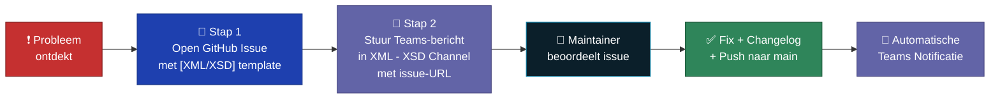
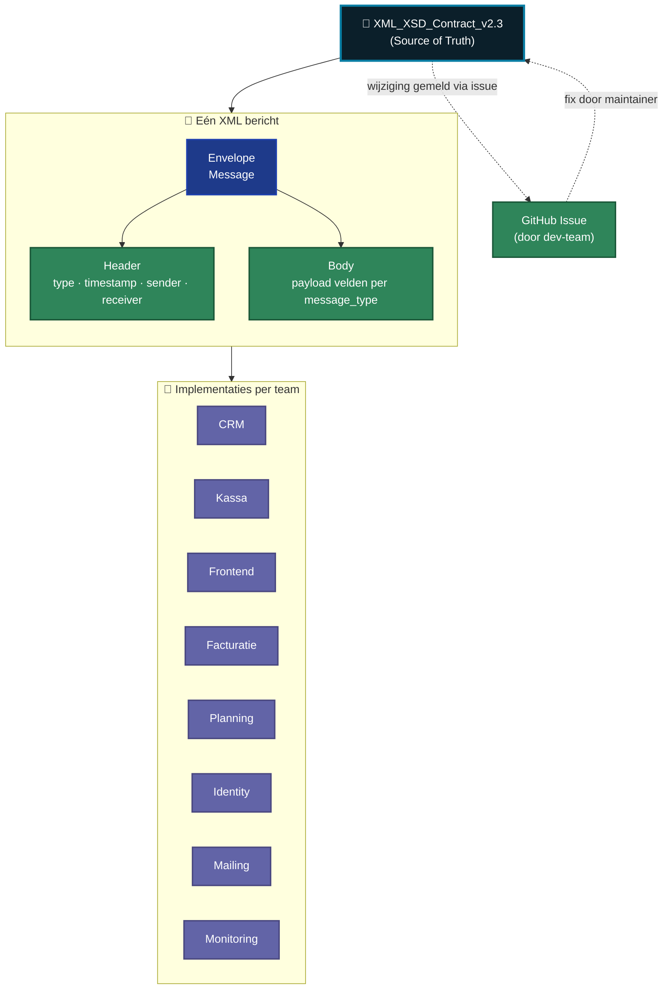
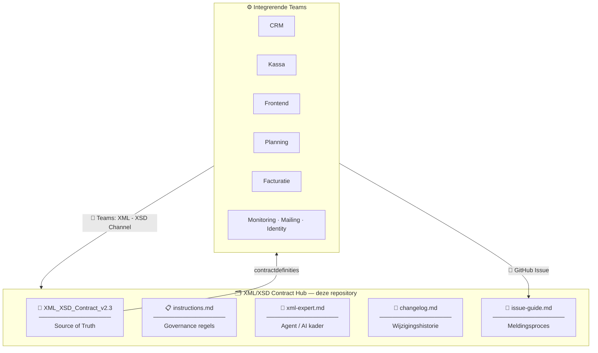
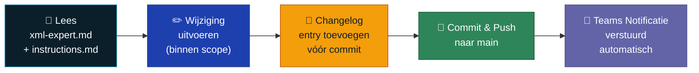
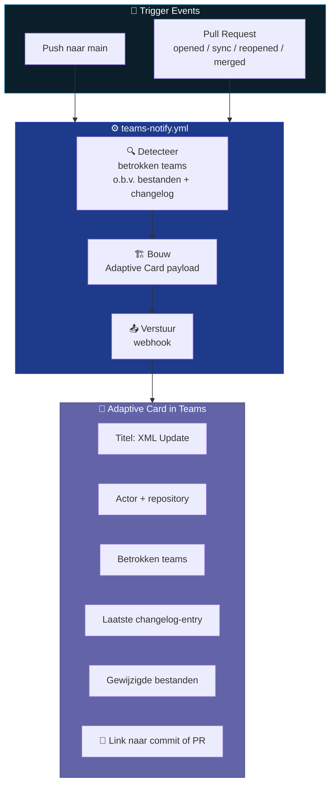

<div align="center">


</div>

<p align="center">
  <a href="XML_XSD_Contract_v2.3_Centralized%201.md"></a>
  <a href="XML_XSD_Contract_v2.3_Centralized%201.md"></a>
  <a href="instructions.md"></a>
  <a href="#kernbestanden"></a>
</p>

<p align="center">
  <a href="https://github.com/IntegrationProject-Groep1/xml-xsd-contract/actions"></a>
  <a href="changelog.md"></a>
  <a href="https://github.com/IntegrationProject-Groep1/xml-xsd-contract/actions/workflows/teams-notify.yml"></a>
  <a href="#maintainers"></a>
  <a href="changelog.md"></a>
  <a href="https://github.com/IntegrationProject-Groep1/xml-xsd-contract/actions/workflows/enforce-maintainers.yml"></a>
</p>

> **Wat is dit?**
> Deze repository is de **centrale Source of Truth** voor alle XML/XSD berichtafspraken binnen het Integration Project. Elke koppeling — CRM, Kassa, Frontend, Planning, Facturatie en meer — is gebonden aan de contractdefinities die hier beheerd worden. Afwijkingen worden hier gemeld, besproken en vastgelegd.

---

## Inhoudsopgave

**🧑‍💻 Voor developers (start hier)**
1. [Quickstart voor Developers](#quickstart-voor-developers)
2. [Probleem of vraag? Zo meld je het](#probleem-of-vraag-zo-meld-je-het)
3. [Berichtenstromen tussen teams](#berichtenstromen-tussen-teams)
4. [Hoe het XML/XSD contract in elkaar zit](#hoe-het-xmlxsd-contract-in-elkaar-zit)
5. [Kernbestanden](#kernbestanden)

**🛠️ Voor maintainers & beheer**

6. [Doelgroep en rechten](#doelgroep-en-rechten)
7. [Voor Maintainers: Wijzigingen Doorvoeren](#voor-maintainers-wijzigingen-doorvoeren)
8. [Governance & Regels](#governance--regels)
9. [Teams Notificaties (Automatisch)](#teams-notificaties-automatisch)
10. [Secrets Configuratie](#secrets-configuratie)
11. [Samenwerkingsafspraken](#samenwerkingsafspraken)

---

## 🧑‍💻 Voor Developers

## Quickstart voor Developers

> **Werk je aan CRM, Kassa, Frontend, Planning, Facturatie, Monitoring, Mailing of Identity?** Dan ben je een **developer** van een integrerend team. Deze sectie is jouw startpunt.

| Wat wil je doen? | Ga naar |
|---|---|
| 📖 Het officiële XML/XSD contract lezen | [`XML_XSD_Contract_v2.3_Centralized 1.md`](XML_XSD_Contract_v2.3_Centralized%201.md) |
| 🐞 Een fout, onduidelijkheid of regressie melden | [Probleem of vraag? Zo meld je het](#probleem-of-vraag-zo-meld-je-het) |
| 🔁 Begrijpen welke berichten jouw team raken | [Berichtenstromen tussen teams](#berichtenstromen-tussen-teams) |
| 🧱 Zien hoe een bericht is opgebouwd | [Hoe het XML/XSD contract in elkaar zit](#hoe-het-xmlxsd-contract-in-elkaar-zit) |
| 📋 Het issue-template stap voor stap volgen | [`issue-guide.md`](issue-guide.md) |
| 📜 De recentste wijzigingen bekijken | [`changelog.md`](changelog.md) |

### Drie regels die altijd gelden voor developers

1. **Wijzig nooit zelf** een contractbestand of open een Pull Request — dit wordt technisch geblokkeerd door [`enforce-maintainers.yml`](.github/workflows/enforce-maintainers.yml).
2. **Open altijd een GitHub Issue** met het `[XML/XSD]` template wanneer je iets ziet dat niet klopt.
3. **Plaats daarna een bericht in Teams** in het kanaal **XML - XSD Channel** met de issue-URL, zodat de maintainers het direct zien.

---

## Probleem of vraag? Zo meld je het

> Je mag het contract **niet** zelf wijzigen of een Pull Request openen. Dit wordt technisch geblokkeerd.
> Volg onderstaand twee-stappen-proces wanneer je een fout, onduidelijkheid of gewenste wijziging tegenkomt.



### Wanneer open je een issue?

Open een issue als je een van deze situaties tegenkomt:

- XML komt niet overeen met het centrale contract.
- XSD validatie faalt.
- Message type, header of body wijkt af van de afgesproken structuur.
- Onzekerheid over interpretatie van een contractregel.
- Regressie na een wijziging.
- Een nieuwe flow of berichtveld dat in het contract zou moeten staan.

### Stap 1 — Open een formeel GitHub Issue

1. Ga naar **[Issues → New Issue](https://github.com/IntegrationProject-Groep1/xml-xsd-contract/issues/new/choose)**.
2. Kies het `[XML/XSD]` template.
3. Vul het template volledig in (zie [`issue-guide.md`](issue-guide.md) voor details):
   - Samenvatting van het probleem
   - Verwacht vs. huidig gedrag
   - Betrokken contractsectie (bv. `XML_XSD_Contract_v2.3 - sectie 11.1`)
   - Reproductiestappen
   - Voorbeeld XML/XSD of foutmelding
   - Impact op teams/flows
4. Label het issue correct: `xml`, `xsd`, `bug`, `contract`.
5. Submit het issue en **kopieer de issue-URL**.

### Stap 2 — Stuur direct daarna een bericht in Teams

Ga naar het Microsoft Teams kanaal: **XML - XSD Channel**

Stuur een bericht met:
- De issue-URL uit stap 1
- Een korte omschrijving van het probleem
- Welke flow/team er impact van ondervindt

> Dit zorgt ervoor dat maintainers **direct** op de hoogte zijn en de urgentie kunnen inschatten. Enkel een issue zonder Teams-bericht kan over het hoofd worden gezien.

### Tips voor sterke issues

- Voeg concrete voorbeelden toe (XML-snippets, foutmeldingen, log-lijnen).
- Vermeld exact het berichttype en de flow.
- Verwijs naar de juiste contractsectie.
- Vermijd vage omschrijvingen zoals *"werkt niet"* zonder context.

---

## Berichtenstromen tussen teams

> Deze diagrammen geven jou een **overzicht in één oogopslag** van hoe RabbitMQ berichten tussen teams reizen, en welke berichten jouw team raken.

### Interactieve Netwerk-Map

Deze kaart wordt automatisch gegenereerd op basis van de contractdefinities en toont alle live berichtstromen tussen teams.

<!-- NETWORK_MAP_START -->

<div align='center'>


</div>

---

#### 🧭 System Integration Key
| Integration Flow | Architectural Path Description |
| :--- | :--- |
|  | Functioneel bericht **NAAR** de CRM (Hub Entrance) |
|  | Functioneel bericht **VANAF** de CRM (Hub Exit) |
|  | Direct bericht **TUSSEN TEAMS** (Bypass Hub) |
|  | **HEARTBEATS** / Status updates naar Monitoring |

---


<!-- NETWORK_MAP_END -->

Elke koppeling **implementeert** de XML/XSD structuur zoals gedefinieerd in het centrale MD-bestand. Wijzigingen gaan altijd via de maintainers en worden bijgehouden in `changelog.md`. Teams ontvangen automatisch een melding via Microsoft Teams bij elke update.

---

## Hoe het XML/XSD contract in elkaar zit

> Korte conceptuele blik op hoe een bericht is opgebouwd en hoe het zich verhoudt tot het centrale MD-document.



**Belangrijk om te onthouden als developer:**

- Het centrale MD-bestand is de **enige** functionele waarheid — niet de implementaties van een individueel team.
- Header-velden zijn **identiek** in elk berichttype; alleen de body verschilt per `message_type`.
- Wijk je af van de structuur? **Dan is jouw implementatie fout, niet het contract.** Open een issue als je denkt dat het contract zelf moet wijzigen.

---

## Kernbestanden

| Bestand | Doel |
|---|---|
| [`XML_XSD_Contract_v2.3_Centralized 1.md`](XML_XSD_Contract_v2.3_Centralized%201.md) | Officieel, gecentraliseerd XML/XSD contract — de functionele waarheid |
| [`xml-expert.md`](xml-expert.md) | Agent-definitie en strikte werkmodus voor contractwijzigingen |
| [`instructions.md`](instructions.md) | Bindende werkinstructies voor alle bijdragers (mens en AI) |
| [`issue-guide.md`](issue-guide.md) | Stap-voor-stap handleiding voor het openen van XML/XSD issues |
| [`changelog.md`](changelog.md) | Volledige historiek van wijzigingen met datum, tijd en auteur |

---

<div align="center">

</div>

## 🛠️ Voor Maintainers & Beheer

> De volgende secties zijn relevant voor **maintainers, projectmanagers en mensen die governance bewaken**. Als developer hoef je dit niet te lezen om je werk te kunnen doen.

---

## Doelgroep en rechten

| Rol | Teams | Rechten |
|---|---|---|
| **Maintainer** | @tombomeke-ehb + aangewezen developer | Lezen · Wijzigen · Pushen naar `main` · PR mergen |
| **Niet-Admin User (developer)** | CRM · Kassa · Frontend · Planning · Facturatie · Monitoring · Mailing · Identity | Lezen · Issues openen · Teams-bericht sturen |

> ⚠️ **Niet-Admin Users mogen GEEN directe wijzigingen of Pull Requests doen aan de contractbestanden.**
> Dit is technisch afgedwongen via [`.github/workflows/enforce-maintainers.yml`](.github/workflows/enforce-maintainers.yml).
> Bij problemen of vragen volg je het proces onder [Probleem of vraag? Zo meld je het](#probleem-of-vraag-zo-meld-je-het).

### Source of Truth Architectuur

De contractdefinities in deze repository bepalen de structuur voor alle integrerende systemen:



---

<a name="maintainers"></a>

## Voor Maintainers: Wijzigingen Doorvoeren

**Actieve Maintainers:** @tombomeke-ehb · aangewezen developer

### Workflow bij elke wijziging



1. Lees [`xml-expert.md`](xml-expert.md) en [`instructions.md`](instructions.md) — verplicht bij elke sessie.
2. Werk in kleine, begrijpelijke stappen; pas alleen aan wat binnen scope valt.
3. Vermijd brede bulk-wijzigingen zonder duidelijke motivatie.
4. Noteer impact op teams, flows en message types.
5. Schrijf duidelijke commit- en PR-beschrijvingen.
6. Update [`changelog.md`](changelog.md) **vóór** de commit.

### Enforcement

Toegang wordt gecontroleerd via:

- [`.github/workflows/enforce-maintainers.yml`](.github/workflows/enforce-maintainers.yml) — blokkeert contractwijzigingen van niet-maintainers.
- Secret `ALLOWED_CONTRACT_EDITORS` — komma-gescheiden lijst van toegestane GitHub usernames.

> Zonder deze secret faalt de enforcement workflow bewust.

---

## Governance & Regels

> De volgende regels zijn bindend voor iedereen die in of met deze repository werkt.
> Volledig kader: [`instructions.md`](instructions.md).

### Scope & Autoriteit

- Deze repository beheert de contract-documentatie en afspraken rond XML/XSD berichten.
- Het centrale contractbestand is de **functionele waarheid** voor structuur en validatieregels.
- Wijzigingen gebeuren bewust en gecontroleerd — nooit impulsief.
- **Alleen aangewezen maintainers** mogen wijzigingen uitvoeren.

### Kwaliteitsregels

- Consistentie gaat voor snelheid.
- Elke wijziging heeft een expliciete, gedocumenteerde reden.
- Berichtstructuren, naming en versies blijven uniform.
- Vermijd regressies door wijzigingen te toetsen aan bestaande afspraken.
- Twijfelgevallen worden eerst als issue gedocumenteerd.

### Verplichte Changelog-Entry

Na elke wijziging volgt **direct** een entry in `changelog.md` met dit formaat:

```md
## YYYY-MM-DD HH:MM (tijdzone)
- Auteur: ...
- Betrokken teams: ...
- Bestanden: ...
- Wijziging: ...
- Reden: ...
```

> Geen changelog-entry = geen complete wijziging.

### Definitie van Klaar

Een wijziging is pas klaar als:

1. De wijziging binnen scope is uitgevoerd.
2. De aanpassing duidelijk is beschreven.
3. `changelog.md` is bijgewerkt met datum en tijd.
4. Eventuele issue/PR context volledig is ingevuld.

---

## Teams Notificaties (Automatisch)

Bij elke push naar `main` of PR-event stuurt [`.github/workflows/teams-notify.yml`](.github/workflows/teams-notify.yml) automatisch een Adaptive Card naar het **XML - XSD Teams channel**.



**Getriggerde events:**
- `push` naar `main`
- `pull_request` → opened, synchronize, reopened, merged

---

## Secrets Configuratie

Beide secrets zijn vereist voor volledige werking van de workflows.

### `TEAMS_WEBHOOK_URL`

Benodigd door: `teams-notify.yml`

1. Open GitHub repo **Settings**.
2. Ga naar **Secrets and variables → Actions**.
3. Klik **New repository secret**.
4. Naam: `TEAMS_WEBHOOK_URL`
5. Waarde: jouw Power Automate webhook URL.
6. Opslaan.

> Zonder deze secret draait de workflow wel, maar verstuurt ze **geen** webhook.

### `ALLOWED_CONTRACT_EDITORS`

Benodigd door: `enforce-maintainers.yml`

1. Open GitHub repo **Settings**.
2. Ga naar **Secrets and variables → Actions**.
3. Klik **New repository secret**.
4. Naam: `ALLOWED_CONTRACT_EDITORS`
5. Waarde: GitHub usernames, komma-gescheiden. Voorbeeld: `tombomeke-ehb,andereusername`
6. Opslaan.

> Zonder deze secret faalt de enforcement workflow bewust om ongeautoriseerde wijzigingen te blokkeren.

---

## Samenwerkingsafspraken

- Kleine, duidelijke wijzigingen werken beter dan grote bulk-edits.
- Elke wijziging is verklaarbaar: wat, waarom, impact.
- Geen wijziging zonder changelog-entry.
- Bij twijfel: issue openen en afstemmen vóór implementatie.
- PR's van niet-maintainers voor contractwijzigingen worden niet geaccepteerd.

---

<div align="center">


<sub><strong>XML/XSD Contract Hub</strong> · Integration Project Groep 1 · Centraal beheer van XML/XSD berichtafspraken</sub>
</div>
